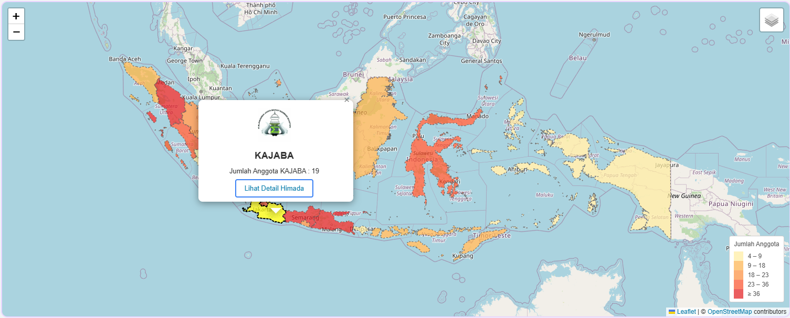
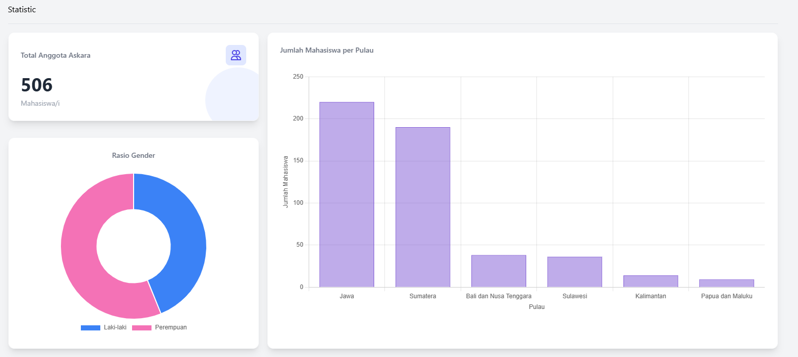

# Pemetaan Wilayah Himada Askara




Proyek ini adalah implementasi tugas akhir mata kuliah Sistem Informasi Geografis (SIG) di Polstat STIS oleh **Rifqi Muhadzib Ahdan**, mahasiswa jurusan DIV Komputasi Statistik. Fokus proyek ini adalah mengeksplorasi dan memvisualisasikan sebaran anggota Himada Askara secara interaktif dan informatif.

## 🎯 **Tujuan Proyek**
- Mengembangkan **sistem informasi geografis (SIG)** berbasis website.
- Memvisualisasikan data spasial anggota Himada Askara dalam format peta interaktif.
- Memberikan analisis statistik terkait anggota berdasarkan wilayah, gender, dan distribusi lainnya.

## 🚀 **Fitur Utama**
1. **Peta Interaktif**: Menampilkan sebaran anggota Himada dengan klasifikasi berbasis kuantil.
2. **Statistik Dinamis**: Statistik jumlah anggota per wilayah, rasio gender, dan distribusi pulau.
3. **Analisis Spasial**: Menggunakan analisis data spasial berbasis area dan titik.
4. **Antarmuka Modern**: Tampilan yang responsif dan user-friendly menggunakan teknologi terkini.

## 🛠 **Teknologi yang Digunakan**
- **Framework Backend**: Laravel
- **Frontend**: Tailwind CSS, AOS.js, Alpine.js
- **Pemetaan**: Leaflet.js, GeoJSON

## 📊 **Analisis Statistik yang Ditampilkan**
- Total anggota berdasarkan wilayah administratif.
- Rasio gender (laki-laki dan perempuan).
- Distribusi anggota berdasarkan pulau.
- Tren jumlah anggota dalam beberapa tahun terakhir (opsional).
- Clustering untuk analisis pola keanggotaan (opsional).

## 📂 **Struktur Folder**
```
├── public/
│   ├── assets/        # File gambar, CSS, dan JavaScript
│   ├── geojson/       # Data GeoJSON untuk peta
├── resources/
│   ├── views/         # File Blade Laravel untuk tampilan
│   ├── js/            # Script interaktif
├── routes/
│   └── web.php        # Routing aplikasi
└── README.md          # Dokumentasi proyek
```

## 🌍 **Cara Menjalankan Proyek**
1. Clone repositori ini:
   ```bash
   git clone https://github.com/username/repository.git
   ```
2. Instal dependensi Laravel:
   ```bash
   composer install
   npm install
   ```
3. Migrasi database:
   ```bash
   php artisan migrate:fresh --seed
   ```
4. Jalankan server lokal:
   ```bash
   php artisan serve
   ```
5. Akses aplikasi melalui browser di `http://localhost:8000`.

## 🤝 **Kontribusi**
Pemilik membuka peluang untuk kontribusi. Kalo kamu memiliki ide, bug fix, atau peningkatan fitur, silakan:
1. Fork repositori ini.
2. Buat branch baru:
   ```bash
   git checkout -b feature-name
   ```
3. Push branch Anda:
   ```bash
   git push origin feature-name
   ```
4. Ajukan pull request.

## 📞 **Kontak**
- **Nama**: Rifqi Muhadzib Ahdan  
- **Kelas**: 2KS2 | Kajaba  
- **Email**: 222313350@stis.ac.id

---
Dikembangkan dengan ❤️ oleh Rifqi Muhadzib Ahdan, Polstat STIS.